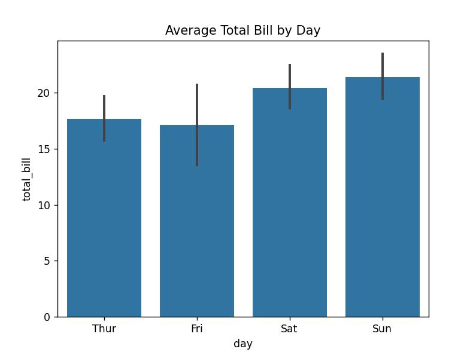
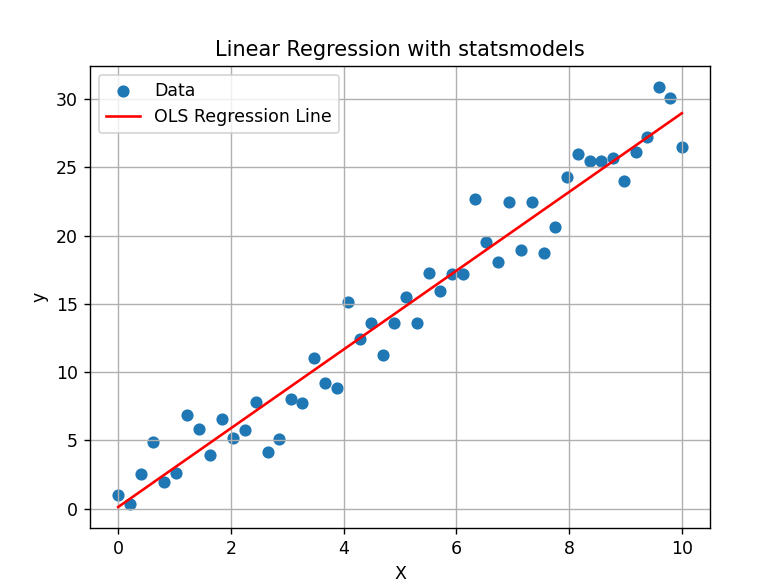
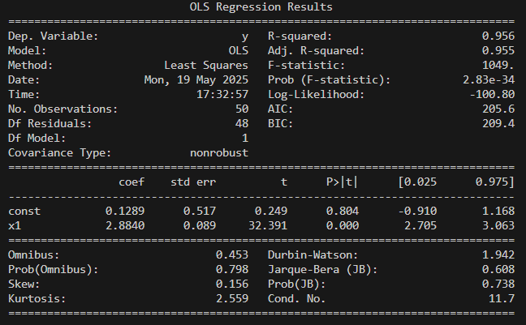

# **PYTHON FOR DATA SCIENCE**
## **Table of Contents**
>[History](#history)  
>>[Early Years](#early-years-1991---2003)  
>>[Emergence of DS-Specific Libraries](#emergence-of-ds-specific-libraries-2007---2014)  
>>[Machine Learning Boom](#machine-learning-boom-2015---present)  

>[Strengths of Python](#strengths-of-python)  
>>[Ease of Use and Readability](#1-ease-of-use-and-readability)  
>>[Extensive Libraries and Frameworks](#2-extensive-libraries-and-frameworks)  
>>[Community Support](#3-community-support)  
>>[Integration Capabilities](#4-integration-capabilities)  
>>[Data Science and Machine Learning Focus](#5-data-science-and-machine-learning-focus)  
>>[Performance and Scalability](#6-performance-and-scalability)  
>>[Cross-Disciplinary Usability](#7-cross-disciplinary-usability)  

>[Primary Libraries and Tools](#primary-libraries-and-tools)  
>>[NumPy](#numpy---numerical-operations-and-array-manipulation)  
>>[Pandas](#pandas---data-manipulation-and-analysis)  
>>[Seaborn](#seaborn--data-visualization)  
>>[SciPy](#scipy--scientific-and-technical-computing)  
>>[Scikit-learn](#scikit-learn--machine-learning)  
>>[PyTorch](#pytorch--deep-learning-frameworks)  
>>[Statsmodels](#statsmodels--statistical-modeling)  
>>[SQLAlchemy](#sqlalchemy--database-interaction) 

>[How Python Compares to Other Languages](#how-python-compares-to-other-languages)  
>>[R](#r)  
>>[Julia](#julia)  
>>[Scala](#scala-w-spark)  
>>[MATLAB](#matlab)  


## **History**
### Early Years (1991 - 2003)
- Python (1991) created by Guido van Rossum for web development, automation, and system administration.

- NumPy (2001) provided the language with tools like ndarray that could work more efficiently with large arrays and matrices.

- Matplotlib (2003) allowed users to create static, animated, and interactive visualizations.
 ### Emergence of DS-Specific Libraries (2007 - 2014)
- Scikit-learn (2007) built on NumPy and SciPy, providing simple and efficient tools for data mining, clustering, regression, classification, and more. It made machine learning more accessible to Python developers and researchers.

- Pandas (2008) introduced the DataFrame object, which became the standard for handling tabular data in Python.

- Jupyter (2014) offered an interactive and reproducible environment for data exploration, analysis, and visualization.
### Machine Learning Boom (2015 - Present)
- TensorFlow (2015), written in Python, made it easier to build and train deep neural networks. TensorFlow helped cement Python’s place in the machine learning and AI world.

- PyTorch (2016) was another Python-based deep learning framework. PyTorch gained popularity for its dynamic computation graph and ease of use, especially among researchers. Its close integration with Python made it a favorite for academic research in AI and machine learning.

- Keras (2015), a high-level neural networks API that could run on top of TensorFlow, Theano, and other backends. Keras made deep learning more accessible to non-experts by providing a simple and modular API for building complex models.

- Python is still the language of choice for most cutting-edge AI and deep learning research. Libraries like Hugging Face’s Transformers and OpenAI’s GPT models are all built with Python.

## **Strengths of Python**
### 1. Ease of Use and Readability
- Syntax is clean and intuitive, making it easy for both beginners and experienced programmers to write and understand code.

- Allows data scientists to focus on problem-solving rather than struggling with complex language constructs.

### 2. Extensive Libraries and Frameworks
- I will later explain and demonstrate the capabilities of various Python libraries that have been built for Data Science use, including NumPy, Pandas, Matplotlib, Seaborn, SciPy, Scikit-learn, PyTorch, and Statsmodels.

### 3. Community Support
- Large active community of developers and data scientists. This leads to a constant flow of new resources, tutorials, and solutions to problems.

- Anyone can contribute to the language’s growth because it is open source. New libraries and updates are constantly being added to address the ever-evolving needs of data science.

### 4. Integration Capabilities
- Can interface with C/C++ code for high-performance computations, Java for enterprise applications, and SQL for working with databases.

- Can be embedded in larger systems and can interact with web frameworks, making it a versatile tool for building end-to-end data science applications.

### 5. Data Science and Machine Learning Focus
- TensorFlow, Keras, XGBoost, and LightGBM (some of the best-known machine learning libraries) are written in Python.

- Jupyter Notebooks (formerly IPython) are a huge asset in the Python ecosystem, providing an interactive environment for testing, experimenting, and documenting data science workflows.

### 6. Performance and Scalability
- Balances performance with simplicity. Many Python libraries are built on top of faster languages like C, so operations on large datasets are still efficient.

- Can scale from small datasets to big data, and it integrates well with tools like Apache Spark for handling distributed data processing.

### 7. Cross-Disciplinary Usability
- Used by data scientists, web developers, system administrators, and even by professionals in fields like finance, academia, and engineering.

## **Primary Libraries and Tools**
### NumPy - Numerical Operations and Array Manipulation
- the backbone for scientific computing workflows in Python, powering libraries like Pandas, Scikit-learn, TensorFlow, and Matplotlib.

- provides an efficient multi-dimensional array object (ndarray) and a collection of mathematical functions to perform operations on these arrays. **For example:**

    ```python 
    import numpy as np

    # Create a 2D array with numbers 1 through 9
    arr = np.arange(1, 10).reshape(3, 3)

    # Perform the square root operation on this array
    sqrt_arr = np.sqrt(arr)

    print(arr)
    # Output: [[1 2 3]
    #          [4 5 6]
    #          [7 8 9]]

    print(sqrt_arr)
    # Output: [[1.         1.41421356 1.73205081]
    #          [2.         2.23606798 2.44948974]
    #          [2.64575131 2.82842712 3.        ]]
---
### Pandas - Data Manipulation and Analysis
- Allows you to work with / aggregate structured data (e.g., tabular data like CSVs or SQL tables) with the DataFrame object. **For example:**

    ``` python
    import pandas as pd

    # Sample sales data
    data = {
        'Product': ['Apple', 'Banana', 'Apple'],
        'Quantity': [10, 5, 7],
        'Price': [0.5, 0.2, 0.5]
    }

    # Create DataFrame
    df = pd.DataFrame(data)

    # Calculate total revenue per row
    df['Revenue'] = df['Quantity'] * df['Price']

    # Group by Product and sum up revenue and quantity
    summary = df.groupby('Product').agg({
        'Quantity': 'sum',
        'Revenue': 'sum'
    })

    print("Sales DataFrame:")
    print(df)

    print("\nSummary by Product:")
    print(summary)
    ```
- The output would look like this:
    ```
    Sales DataFrame:
      Product  Quantity  Price  Revenue
    0   Apple        10    0.5      5.0
    1  Banana         5    0.2      1.0
    2   Apple         7    0.5      3.5

    Summary by Product:
             Quantity  Revenue
    Product                    
    Apple          17      8.5
    Banana          5      1.0
---
### Seaborn – Data Visualization
- General-purpose plotting library that builds on Matplotlib, simplifying the creation of complex visualizations.

- With this library, users can create line charts, scatter plots, histograms, box plots, and other useful graphs. **For example:**
    ```python
    import seaborn as sns
    import matplotlib.pyplot as plt

    # Load data
    tips = sns.load_dataset("tips")

    # Create a boxplot
    sns.boxplot(x="day", y="total_bill", data=tips)

    # Show the plot
    plt.title("Total Bill Distribution by Day")
    plt.show()
- The output would look like this:

  
---
### SciPy – Scientific and Technical Computing.
- Offers optimization, integration, interpolation, eigenvalue problems, and other advanced calculations. **For example, here is some code that calculates the minimum point on a graph**:

    ```python
    from scipy.optimize import minimize

    # Example: minimize f(x) = x^2 + 3x + 2
    def f(x):
        return x2 + 3*x + 2

    result = minimize(f, x0=0)  # initial guess x0=0
    print(result.x)  # minimum point
    # Output: [-1.5]
---
### Scikit-learn – Machine Learning
- Implements a wide variety of algorithms (regression, classification, clustering, etc.).

- Provides tools for model evaluation, cross-validation, and hyperparameter tuning.

- **For example, here is a model which classifies flowers with K-Nearest Neighbors (KNN)**:
    ```python
    import numpy as np
    from sklearn.datasets import load_iris
    from sklearn.model_selection import train_test_split
    from sklearn.preprocessing import StandardScaler
    from sklearn.neighbors import KNeighborsClassifier
    from sklearn.metrics import accuracy_score

    # Step 1: Load the Iris dataset (which contains data about flowers)
    iris = load_iris()
    X = iris.data  # Features (e.g., petal length, petal width, etc.)
    y = iris.target  # Labels (species of flowers)

    # Step 2: Split the data into training and testing sets
    X_train, X_test, y_train, y_test = train_test_split(X, y, test_size=0.3, random_state=42)

    # Step 3: Preprocess the data (standardize it to make all features have similar ranges)
    scaler = StandardScaler()
    X_train = scaler.fit_transform(X_train)
    X_test = scaler.transform(X_test)

    # Step 4: Create a K-Nearest Neighbors (KNN) classifier and train it
    knn = KNeighborsClassifier(n_neighbors=3)
    knn.fit(X_train, y_train)

    # Step 5: Make predictions on the test data
    y_pred = knn.predict(X_test)

    # Step 6: Evaluate the model's performance (accuracy)
    accuracy = accuracy_score(y_test, y_pred)
    print(f"Accuracy: {accuracy * 100:.2f}%")
---
### PyTorch – Deep Learning Frameworks
- Allow you to build and train neural networks and other advanced AI models.

- Capable of building convolutional neural networks (CNNs) for image classification or recurrent neural networks (RNNs) for time series prediction. **For example, here is a script which can learn patterns in a time series (in this case, a sine wave) and predict future values based on past observations**:
    ```python
    # Step 1: Import libraries
    import numpy as np
    import matplotlib.pyplot as plt
    import torch
    import torch.nn as nn
    from torch.utils.data import TensorDataset, DataLoader

    # Step 2: Generate a synthetic time series (sine wave + noise)
    time = np.arange(0, 100, 0.1)
    series = np.sin(time) + 0.1 * np.random.randn(len(time))

    # Step 3: Plot the original time series
    plt.figure(figsize=(10, 4))
    plt.plot(time, series)
    plt.title("Generated Time Series")
    plt.xlabel("Time")
    plt.ylabel("Value")
    plt.grid(True)
    plt.show()

    # Step 4: Prepare the dataset using a sliding window
    def create_dataset(series, window_size):
        X, y = [], []
        for i in range(len(series) - window_size):
            X.append(series[i:i + window_size])
            y.append(series[i + window_size])
        return np.array(X), np.array(y)

    window_size = 20
    X, y = create_dataset(series, window_size)

    # Convert to PyTorch tensors
    X = torch.tensor(X, dtype=torch.float32).unsqueeze(-1)  # Shape: [samples, window_size, 1]
    y = torch.tensor(y, dtype=torch.float32).unsqueeze(-1)  # Shape: [samples, 1]

    # Create DataLoader
    dataset = TensorDataset(X, y)
    loader = DataLoader(dataset, batch_size=32, shuffle=True)

    # Step 5: Define the LSTM model in PyTorch
    class LSTMModel(nn.Module):
        def __init__(self, input_size=1, hidden_size=64):
            super(LSTMModel, self).__init__()
            self.lstm = nn.LSTM(input_size, hidden_size, batch_first=True)
            self.linear = nn.Linear(hidden_size, 1)

        def forward(self, x):
            out, _ = self.lstm(x)
            out = self.linear(out[:, -1, :])  # Only the last time step
            return out

    model = LSTMModel()
    criterion = nn.MSELoss()
    optimizer = torch.optim.Adam(model.parameters(), lr=0.001)

    # Step 6: Train the model
    epochs = 10
    model.train()
    for epoch in range(epochs):
        for xb, yb in loader:
            pred = model(xb)
            loss = criterion(pred, yb)
            optimizer.zero_grad()
            loss.backward()
            optimizer.step()
        print(f"Epoch {epoch+1}/{epochs}, Loss: {loss.item():.4f}")

    # Step 7: Forecast the next 50 values
    model.eval()
    forecast_input = torch.tensor(series[-window_size:], dtype=torch.float32).unsqueeze(0).unsqueeze(-1)  # [1, window_size, 1]
    forecast = []

    for _ in range(50):
        with torch.no_grad():
            next_val = model(forecast_input)[0, 0].item()
        forecast.append(next_val)

        # Append and shift the window
        next_input = forecast_input[:, 1:, :].clone()
        next_input = torch.cat((next_input, torch.tensor([[[next_val]]])), dim=1)
        forecast_input = next_input

    # Step 8: Plot the forecast
    plt.figure(figsize=(10, 4))
    plt.plot(series, label='Original Series')
    plt.plot(np.arange(len(series), len(series) + len(forecast)), forecast, label='Forecast', color='red')
    plt.xlabel("Time Step")
    plt.ylabel("Value")
    plt.title("Time Series Forecast with PyTorch LSTM")
    plt.legend()
    plt.grid(True)
    plt.show()
---
### Statsmodels – Statistical Modeling
- Provides tools for performing statistical tests and building regression models

- **For example, here is a program that uses linear regression**:
    ```python
    # Step 1: Import libraries
    import numpy as np
    import statsmodels.api as sm
    import matplotlib.pyplot as plt

    # Step 2: Generate synthetic data (y = 3x + noise)
    np.random.seed(42)
    X = np.linspace(0, 10, 50)
    y = 3 * X + np.random.normal(0, 2, size=X.shape)

    # Step 3: Add constant term for intercept (required by statsmodels)
    X_with_const = sm.add_constant(X)  # adds a column of 1s

    # Step 4: Fit the OLS (Ordinary Least Squares) regression model
    model = sm.OLS(y, X_with_const)
    results = model.fit()

    # Step 5: Print model summary
    print(results.summary())

    # Step 6: Predict values and plot the result
    y_pred = results.predict(X_with_const)

    plt.scatter(X, y, label='Data')
    plt.plot(X, y_pred, color='red', label='OLS Regression Line')
    plt.xlabel("X")
    plt.ylabel("y")
    plt.title("Linear Regression with statsmodels")
    plt.legend()
    plt.grid(True)
    plt.show()
- The outputs will look like this:

    

    
---
### SQLAlchemy – Database Interaction

- Helps you to query SQL databases directly from Python. **Example**:

    ```python
    # Step 1: Import SQLAlchemy tools
    from sqlalchemy import Column, Integer, String, create_engine
    from sqlalchemy.orm import declarative_base, sessionmaker

    # Step 2: Set up database and base class
    Base = declarative_base()

    # Step 3: Define a table using a Python class
    class User(Base):
        __tablename__ = 'users'

        id = Column(Integer, primary_key=True)
        name = Column(String)
        age = Column(Integer)

        def __repr__(self):
            return f"<User(id={self.id}, name='{self.name}', age={self.age})>"

    # Step 4: Connect to SQLite database (or create it)
    engine = create_engine('sqlite:///example.db', echo=True)
    Base.metadata.create_all(engine)

    # Step 5: Create a session to talk to the database
    Session = sessionmaker(bind=engine)
    session = Session()

    # Step 6: Add new users
    user1 = User(name="Alice", age=30)
    user2 = User(name="Bob", age=25)
    session.add_all([user1, user2])
    session.commit()

    # Step 7: Query the users
    print("\nAll users:")
    for user in session.query(User).all():
        print(user)

    # Step 8: Filter users
    print("\nUsers older than 27:")
    for user in session.query(User).filter(User.age > 27):
        print(user)

    # Step 9: Update a user
    user_to_update = session.query(User).filter_by(name="Bob").first()
    user_to_update.age = 26
    session.commit()

    # Step 10: Delete a user
    user_to_delete = session.query(User).filter_by(name="Alice").first()
    session.delete(user_to_delete)
    session.commit()

    # Final state of users table
    print("\nFinal users in database:")
    for user in session.query(User).all():
        print(user)

    # Step 11: Close the session
    session.close()
---
## **How Python Compares to Other Languages**
### R
- Better for pure statistical modeling, bioinformatics, and visualization (ggplot2, Shiny).

- Weaker in ML production, general-purpose programming, and deep learning.
### Julia
- Faster for numerical computations; designed for scientific computing.

- Smaller ecosystem, less mature libraries.
### Scala (w/ Spark)
- Best for distributed big data processing.

- More complex syntax, steeper learning curve.
### MATLAB
- Strong in numerical analysis, engineering, and signal processing.

- Proprietary, less flexible, poor for large-scale production or ML workflows.